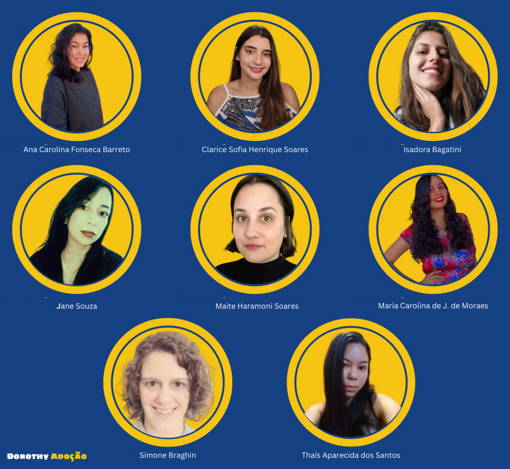

# Abrigo para adoção de animais

O projeto desenvolvido como Desafio final do Bootcamp de Back-End Python visa consolidar e aplicar o conhecimento adquirido em GitHub, HTML5, CSS3, Bancos de Dados e o Framework Django. Criando uma aplicação responsiva com recursos robustos, integrando elementos como banco de dados, gerenciamento de conteúdo e interatividade.

### Funcionalidades do Projeto

- SearchBar (Barra de pesquisa): Filtrando animais por nome, especie,raça,porte,idade,sexo.

## Integrantes do Squad:

 

- [Ana Carolina Fonseca Barreto](https://github.com/anafbarreto)
- [Jane Souza](https://github.com/janessf)
- [Simone Braghin](https://github.com/SimoneBraghin)
- [Clarice Sofia Henrique Soares](https://github.com/claricesoares)
- [Isadora Bagatini](https://github.com/IsahBag)
- [Maitê Haramoni Soares](https://github.com/maiharamoni)
- [Thaís Aparecida dos Santos](https://github.com/ThaisAp10)
- [Maria Carolina de J. de Moraes](https://github.com/CarolinaSanches24)
